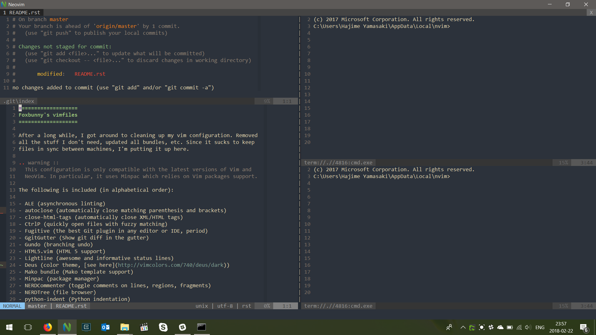

# Foxbunny's vimfiles

This configuration bundle is for Vim 8.x and newer.

**WARNING:** This configuration is only compatible with the latest versions of
Vim. NeoVim is not supported explicitly, although you may get lucky. Also, this 
configuration assumes vimdir is `~/.vim` (not the case on Windows).


<!-- vim-markdown-toc GFM -->

* [Features](#features)
* [Requirements](#requirements)
* [Installation](#installation)
* [Using the configuration](#using-the-configuration)
* [Initializing the plugins](#initializing-the-plugins)
* [Machine-specific configuration](#machine-specific-configuration)
* [Project-specific configuration](#project-specific-configuration)
* [Keyboard shortcuts](#keyboard-shortcuts)
* [Autocommands](#autocommands)
* [Autosave](#autosave)
* [Managing projects](#managing-projects)
* [Screenshot](#screenshot)
* [Troubleshooting](#troubleshooting)
  * [JavaScript/TypeScript features are not working](#javascripttypescript-features-are-not-working)
* [License](#license)

<!-- vim-markdown-toc -->

## Features

The plugin set provides full support for the following languages:

- Dockerfiles
- Go
- HTML5/CSS
- JavaScript and JSX
- Mako templates
- Markdown
- Nginx configuration files
- Python
- Shell scripts
- TypeScript and TSX

Following editor features are provided:

- Full git integration
- Fuzzy search for opening files
- Folder tree view
- Linter integration for supported languages
- Spelling
- Toggling light/dark theme
- Auto-close tags
- Text and regexp search of all code in the project
- Automatic vertical text alignment
- Autocompletion in Vim command line
- Autosave on focus loss or `<Esc>`
- Simple project list

There is no intellisense anywhere, and only basic omnicompletion, since I don't
use it very much. Same goes for refactoring tools.

For project-wide search, use `:Ack`, `:LAck`, etc (see 
[the docs](https://github.com/mileszs/ack.vim)). It is configured to use 
[`ag`](https://github.com/ggreer/the_silver_searcher) if it is installed
(recommended).

## Requirements

TL;DR

- Vim
- ag (the silver searcher)
- NodeJS
- TypeScript
- Iosevka font and Sarasa Gothic font

You will need to install Vim (d'oh!) and [ack](https://beyondgrep.com/) or
[ag](https://geoff.greer.fm/ag/) (for searching with Ack). On Ubuntu:

```bash
sudo apt install silversearcher-ag
```

Packages are managed by [vim-plug](https://github.com/junegunn/vim-plug).
Because vimrc includes an automatic install script, you need to have curl
installed on your system. 

Install NodeJS (if you are using NVM, make sure that it is in the `$PATH` for
Vim!) when you launch it. Install `typescript` globally if you want support for
it.

Install the [Iosevka](https://github.com/be5invis/Iosevka/releases) (SS01 
variant) and [Sarasa Gothic](https://github.com/be5invis/Sarasa-Gothic/releases) 
(Sarasa Term J) fonts.

## Installation

To install, just clone the project to a local directory:

```shell
git clone https://github.com/foxbunny/vimfiles.git ~/.vim
```

Install vim-plug:

```shell
bash ~/.vim/getplug.sh
```

Finally, create two directories in your home directory or `%userprofile%`
folder (not needed for NeoVim):

- `.vim_undo` for persistent undo
- `.vim_swap` for storing swap files in a single folder

When starting for the first time, run `:PlugInstall` to install all the
plugins, then restart.

## Using the configuration

NeoVim used to be supported, but I no longer use it, so you're on your own.
Some things may not work as expected.

Symlink the git folder to `~/.vim`:

```
ln -s /path/to/vimfiles.git ~/.vim
```

Also symlink the main configuration file:

```
ln -s /path/to/vimfiles.git/init.vim ~/.vimrc
```

## Initializing the plugins

The first time you start Vim or NeoVim with this configuration, vim-plug will
automatically install itself and any missing plugins. You generally shouldn't
need to do anything.

## Machine-specific configuration

In some cases, the configuration needs to mention paths to various executable
(e.g., Python interpreter in NeoVim). Since these are different for each
platform and possibly other factors, the main configuration file will attempt
to pull in a file called `machine.vim` in your home directory or
`%userprofile%` folder. This file may contain any of the usual NeoVim/Vim
configuration scripts and you can use that to customize the configuration
instead of patching the `init.vim` file.

## Project-specific configuration

Sometimes you may have configuration that applies only to a specific project.
For example, `.html` file may be a Mako template in this project, but an EJS
template in another, or even differ in different subtrees of your project.

Since project-specific configuration support is enabled, dropping a `.vimrc`
file in a directory will apply the contained configuration to the entire tree
allowing you to add directory-specific configuration without having to edit the
default `.vimrc`. This can be used for project-wide configuration or even for
individual components within the project.

## Keyboard shortcuts

Leader character is `,`.

In addition to Vim/NeoVim standard shortcuts, and standard shortcuts provided
by the plugins, the following shortcuts are also mapped:


Shortcut | Name | Function
---|---|---
`,` `w` | write | Save current buffer
`,` `q` | quit | Quit
`,` `Tab` | last buffer | Go to last buffer (`:b#`)
`,` `b` `b` | next buffer | Switch to next buffer
`,` `b` `l` | list buffers | Start CtrlP in buffer mode
`,` `b` `m` | modified buffer | Switch to next modified buffer
`,` `b` `u` | unload buffer | Unload the current buffer
`,` `b` `q` | quit buffer | Delete (quit) the current buffer
`,` `t` `p` | previous tab| Switch to previous tab
`,` `t` `t` | next tab | Switch to next tab
`,` `o` | open with CtrlP | Start CtrlP
`,` <code>`</code> | file list | Toggle NerdTREE
`,` `f` | find current | Open NerdTREE and go to current file
`,` `n` | no highlight | Disable search highlighting
`,` `v` | split vert. | Vertical split
`,` `-` | split horiz. | Horizontal split
`,` `0` | only | Make current split the only buffer (remove all splits)
`,` `s` | git status | Open Git status (Fugitive)
`,` `p` | git push | Push code (`git push`)
`,` `P` | git force push | Force-push code (`git push --force`)
`Ctrl+t` | new tab | Create a new tab
`F8` | spell on/off | Toggle spelling (US English)
`F12` | color theme | Toggle dark and light theme (some themes)

## Autocommands

Whitespace at the end of the lines is stripped automatically when buffer is
saved. This is done for the following file types:

- `*.coffee`
- `*.css`
- `*.js`
- `*.ls`
- `*.py`
- `*.scss`
- `*.tpl`
- `*.ts`
- `*.tsx`
- `*.vue`

## Autosave

Files are automatically saved when we exit insert mode with `<Esc>` or when
Vim loses focus (this only works in GUI mode).

## Managing projects

To avoid editing the `init.vim` configuration file, you can create the
`machine.vim` file in your home directory and add project there. The projects
are specified as per the [vim-project](https://github.com/amiorin/vim-project)
configuration instructions.

For example:

```vim
call project#rc('~/Code')

Project 'vimfiles'
Project 'awesome-app'
```

## Screenshot



## Troubleshooting

### JavaScript/TypeScript features are not working

Node may not be in the `$PATH` for vim. Run the `:!which node` command, and if
it does not find Node, that's the problem.

You could try adding the path to the directory that contains the `node` binary
to one of the following locations:

1. in `~/.profile` file
1. in `~/machine.vim` file

To use the second option, create a file called `machine.vim` in your home
directory, and add something like this to it:

```vim
let $PATH = $PATH . ':' . $HOME . '/.local/share/nvm/v14.18.1/bin'
```

## License

To the extent legally permitted, you are free to do whatever you want with
these files.
