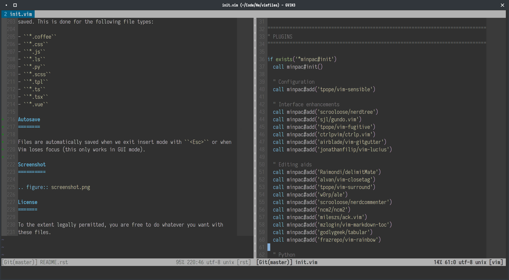

# Foxbunny's vimfiles

This configuration bundle is for Vim 8.x and newer.

**WARNING:** This configuration is only compatible with the latest versions of
Vim. NeoVim is not supported explicitly, although you may get lucky. Also, this 
configuration assumes vimdir is `~/.vim` (not the case on Windows).


<!-- vim-markdown-toc GFM -->

* [Requirements](#requirements)
* [Installation](#installation)
* [Using the configuration](#using-the-configuration)
* [Initializing the plugins](#initializing-the-plugins)
* [Machine-specific configuration](#machine-specific-configuration)
* [Project-specific configuration](#project-specific-configuration)
* [Plugins](#plugins)
* [Keyboard shortcuts](#keyboard-shortcuts)
* [Autocommands](#autocommands)
* [Autosave](#autosave)
* [Screenshot](#screenshot)
* [License](#license)

<!-- vim-markdown-toc -->

## Requirements

You will need to install Vim (d'oh!) and [ack](https://beyondgrep.com/) or
[ag](https://geoff.greer.fm/ag/) (for searching with Ack).

Packages are managed by [vim-plug](https://github.com/junegunn/vim-plug).
Because vimrc includes an automatic install script, you need to have curl
installed on your system. 

## Installation

To install, just clone the project to a local directory:

```shell
git clone --recursive https://github.com/foxbunny/vimfiles.git
```

If you forgot the `--recursive` flag, you need two more commands:

```
git submodule update --init
```

To allow for smooth updating of Minpac, you may also need to do this:

```
cd pack/minpac/opt/minpac
git checkout master
git pull
```

Finally, create two directories in your home directory or `%userprofile%`
folder (not needed for NeoVim):

- `.vim_undo` for persistent undo
- `.vim_swap` for storing swap files in a single folder

## Using the configuration

NeoVim used to be supported, but I no longer use it, so you're on your own.
Some things may not work as expected.

Symlink the git folder to `~/.vim`:

```
ln -s /path/to/vimfiles.git ~/.vim
```

Also symlink the main configuration file:

```
ln -s /path/to/vimfiles.git/init.vim ~/.vimrc
```

## Initializing the plugins

The first time you start Vim or NeoVim with this configuration, vim-plug will
automatically install itself and any missing plugins. You generally shouldn't
need to do anything.

## Machine-specific configuration

In some cases, the configuration needs to mention paths to various executable
(e.g., Python interpreter in NeoVim). Since these are different for each
platform and possibly other factors, the main configuration file will attempt
to pull in a file called `machine.vim` in your home directory or
`%userprofile%` folder. This file may contain any of the usual NeoVim/Vim
configuration scripts and you can use that to customize the configuration
instead of patching the `init.vim` file.

## Project-specific configuration

Sometimes you may have configuration that applies only to a specific project.
For example, `.html` file may be a Mako template in this project, but an EJS
template in another, or even differ in different subtrees of your project.

Since project-specific configuration support is enabled, dropping a `.vimrc`
file in a directory will apply the contained configuration to the entire tree
allowing you to add directory-specific configuration without having to edit the
defualt `.vimrc`. This can be used for project-wide configuration or even for
individual components within the project.

## Plugins

The following is included (in alphabetical order):

- ack.vim (fast project-wide searching
- ALE (asynchronous linting)
- Amber color scheme (supports toggling dark and light)
- close-html-tags (automatically close XML/HTML tags)
- CtrlP (quickly open files with fuzzy matching)
- delimitMate (automatically close matching parenthesis and brackets)
- Dockerfile.vim (support for Dockerfiles)
- Fugitive (the best Git plugin in any editor or IDE, period)
- GgitGutter (Show git diff in the gutter)
- HTML5.vim (HTML 5 support)
- Mako bundle (Mako template support)
- NERDCommenter (toggle comments on lines, regions, fragments)
- NERDTree (file browser)
- nginx.vim (Nginx configuration files)
- python-syntax (Python syntax highlighting)
- python.vim (Python support)
- Sensible (sensible defaults for Vim)
- typescript-vim (TypeScript support)
- vim-javascript (Better JavaScript highlighting and indentation)
- vim-jsx (JSX support)
- vim-mako (Mako template language support)
- vim-markdown-toc (Automatic ToC for Markdown documents)
- vim-plug (package manager)
- vim-surround (Add/change/remove surrounding quotes, brackets, etc.)
- vim-vue (VueJS .vue file support)

The configuration covers the following languages and libraries:

- Python
- HTML5/CSS
- SASS/SCSS
- Mako templates
- JavaScript and JSX
- TypeScript and TSX
- VueJS
- CoffeeScript
- PureScript
- Shell scripts
- Nginx configuration files
- Dockerfiles

There is no intellisense anywhere, and only basic omnicompletion, since I don't
use it very much.

For project-wide search, use `:Ack`, `:LAck`, etc (see 
[the docs](https://github.com/mileszs/ack.vim)). It is configured to use 
[`ag`](https://github.com/ggreer/the_silver_searcher) if it is installed.

## Keyboard shortcuts

Leader character is `,`.

In addition to Vim/NeoVim standard shortcuts, and standard shortcuts provided
by the plugins, the following shorctuts are also mapped:


Shortcut | Name | Function
---|---|---
`,` `w` | write | Save current buffer
`,` `q` | quit | Quit
`,` `Tab` | last buffer | Go to last buffer (`:b#`)
`,` `b` `b` | next buffer | Switch to next buffer
`,` `b` `l` | list buffers | Start CtrlP in buffer mode
`,` `b` `m` | modified buffer | Switch to next modified buffer
`,` `b` `u` | unload buffer | Unload the current buffer
`,` `b` `q` | quit buffer | Delete (quit) the current buffer
`,` `t` `p` | previous tab| Switch to previous tab
`,` `t` `t` | next tab | Switch to next tab
`,` `o` | open with CtrlP | Start CtrlP
`,` <code>`</code> | file list | Toggle NerdTREE
`,` `f` | find current | Open NerdTREE and go to current file
`,` `n` | no highlight | Disable search highlighting
`,` `v` | split vert. | Vertical split
`,` `-` | split horiz. | Horizontal split
`,` `0` | only | Make current split the only buffer (remove all splits)
`,` `s` | git status | Open Git status (Fugitive)
`,` `p` | git push | Push code (`git push`)
`,` `P` | git force push | Force-push code (`git push --force`)
`Ctrl+t` | new tab | Create a new tab
`F8` | spell on/off | Toggle spelling (US English)
`F12` | color theme | Toggle dark and light theme (some themes)

## Autocommands

Whitespace at the end of the lines is stripped automatically when buffer is
saved. This is done for the following file types:

- `*.coffee`
- `*.css`
- `*.js`
- `*.ls`
- `*.py`
- `*.scss`
- `*.tpl`
- `*.ts`
- `*.tsx`
- `*.vue`

## Autosave

Files are automatically saved when we exit insert mode with `<Esc>` or when
Vim loses focus (this only works in GUI mode).

## Screenshot



## License

To the extent legally permitted, you are free to do whatever you want with
these files.
